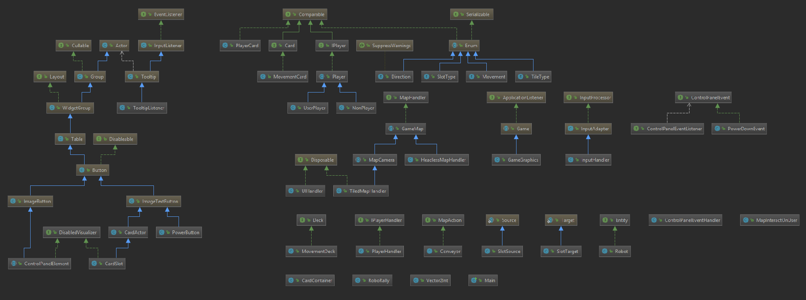

# Obligatorisk øvelse 3

## Deloppgave 1: Prosjekt og prosjektstruktur
* Alt går fint med rollene i teamet:
  * Kundekontakt:
    * Rollen innebærer å finne ut av regler og spillogikk hvis det er noe vi lurer på, dette utøfres ved å lese manualen nøye hvis det er noe som er uklart. Rollen fungerer fint og finner svaret på det gruppen lurer på.
  * Teamlead:
    * Har en god dialog med resten av teamet, folk velger oppgaver selv eller får kommentere på tildelte oppgaver. Jeg tar ansvar for at møtene holder en noenlunde struktur og at vi ikke bruker tiden på diskutere uvesentlige ting.
    * Jeg tar ansvar for at project board, wiki og annet materiale utenom kode er i avtalt struktur.
  * Vi har ingen andre roller, men passer at alle gjør litt av alt.
* Erfaringer mtp prosjektmetodikk:
  * Vi bruker ikke project boardet aktivt, kanskje vi skal gjøre det om til per iterasjon.
* Gruppedynamikk og kommunikasjon:
  * Vi er alle involverte i gruppearbeidet takket være test/utvikler delegering og pull reviews.
  * Vi arbeider til litt forskjellige tider, i tillegg er det noen av oss liker å gjøre alt på en gang mens andre foretrekker å spre det litt ut over tiden. Dette skaper litt ubalanse spesielt i forhol til testing og reviews.
  * Vi har gått ned til ett møte i uken, vi diskuterer litt på slack, og tar det mer formelle på github.
* Retrospektiv:
  * Vi fortsetter med bruk av et kanban board uten begrensninger på kolonnene. Her legger vi også inn arbeidsoppgaver som ikke omhandler koding. 
  * Vi ser at dette kan bli rotete og vanskelig å følge med på, og vi velger derfor å lage et ekstra board som følger iterasjonene hvor kun "kode"-relaterte oppgaver skrives. Dette gjør vi fordi vi ikke er fornøyde med grafikken til project boardet og hvor enkelt det er å følge opp progresjonen i hver enkelt iterasjon.
  * Når vi ser hva de andre har gjort, tenker vi at vi ikke har like mye funksjonalitet på plass. Men vi er veldig fornøyde med den grunnleggende strukturen vår og tror vi vil bli belønnet for dette i de kommende ukene.
  * Vi er fleksible og har ikke for rigide regler. Vi ser an hver oppgave og tilpasser testing, reviews, osv etter behov, men beholder grunnleggende prinsipper.
  * Vi har hatt problemer med å registrere Rikkes commits i github siden hennes arbeid ikke kobles til githubkontoen hennes. Dette har vi fått fikset, problemet var at mailen som var registrert i hennes locale git config var en mail som ikke eksisterer lengre.
  * Vi er veldig fornøyde med utvilker/tester fordelingen vår. Dette fører til gode tester som gjør at når vi i denne iterasjonen har gjort refaktorering har det hjulpet å kunne passe på at man er grønn etter å ha gjort endringer.
* Commits:
  * Elg har mye mer commits enn oss andre, vi ser at han commiter "mindre" blokker enn oss andre. I tillegg har han hatt mye grafikk, som han kjenner fra før, som betyr at tid per kodelinje er mindre. Men vi ser at dette kan forbedres og jobber mot dette.
* Kunnskapsoverføring
  * Vi jobber med noe parprogrammering, spesielt i situasjoner hvor en skal gjøre mye i noe en annen har laget. Dette gjøres for at man skal slippe å måtte sette seg inn i veldig mye ny kode.
  * Vi stiller spørsmål om andres antakelser når vi endrer kode og spør etter spillinformasjon fra de andre, i.e. om vi er usikker på en regel spør vi de andre for å høre hvordan de har tolket den.
  * Elg er vår LibGdx sjef, og vi stiller ham mange tekniske spørsmål. Dette gjelder spesielt under planlegging av iterasjoner og implementasjoner.
* Punkter for forbedring
1. Jobbe mot en bedre commit fordeling.
2. Sette opp et nytt board som følger iterasjonen og se hvordan dette går
3. Øke code coverage ved testing, vi håper at en refaktoreringsjobb skal gjøre det lettere å teste ref (#50) og for å kunne teste kartet har vi fremover lyst til å gjøre #77
   * Vi ligger foreløpig på 60% som vi synes er litt lavt for automatiske tester, sammen med manuelle er vi oppe i 85% som er bra, men om vi egentlig tester alle 85% av linjene ved de manuelle testene er diskutabelt.
4. Populere wiki'en enda mer.
5. At alle har god sinnstemning

* [Møtenotater](https://github.com/inf112-v19/Blodige-roboter/wiki)
* Se [Workflow](https://github.com/inf112-v19/Blodige-roboter/wiki/Workflow) for mer beskrivende arbeidsmetoder
* Se [Run with IntelliJ](https://github.com/inf112-v19/Blodige-roboter/wiki/Other_Run-with-IntelliJ) for hvordan kjøre spillet og kjøre tester
* Se hvordan man spiller spillet [Instructions](https://github.com/inf112-v19/Blodige-roboter/wiki/Specification_Instructions)
* Milestones i issues representerer de forskjellige iterasjonene vi har hatt.
[KlasseDiagram](Oblig3-KlasseDiagram.PNG)

## Deloppgave 2: Krav

### Presisering av krav
* Kunne få alle typene bevegelseskort
  * Gjort tidligere i issue #5 og #47
* Dele ut 9 kort
  * Gjort i issue #5
* Velge 5 kort (godkjenne valg/si “nå er jeg klar”)
  * Gjort i issue #47
  * Trykk enter for å gjøre deg "klar"
* Eksekvere program utfra valgte kort
  * Gjort i issue #5, #47 og #14
* Besøke flagg
  * Her hadde vi lagt grunnleggende funksjonalitet for mapInteraction fra forrige iterasjon.
  * Dermed ble oppgaven #21 laget for denne og forrige iterasjon.
* Hvis robot går av brettet blir den ødelagt og går tilbake til siste backup
  * #44 ble laget for denne iterasjonen
* Oppdatere backup hvis robot blir stående på skiftenøkkelrute i slutten av en fase
  * #20 laget klar for denne iterasjonen
* Flytte backup ved besøk på flagg
  * Gjøres i #20
* Kunne spille en fullverdig runde med alle faser
  * #56 laget for denne iterasjonen
* Få nye kort til ny runde
  * #5 og #47

### Prioritering av oppgaver utifra kundens spesifikasjoner
I fra forrige uke var vi "heldige" på det vi valgte å fokusere på. Derfor var mye gjort i forrige iterasjon mot denne uken. For eksempel #5, #47, #14, #20. 

### Akseptkriterier
* Kunne få alle typene bevegelseskort
  * Skal følge orginalspillets regler og kortene skal være unike mht prioritering. Alle kort skal ha hjelpetekst.
* Dele ut 9 kort
  * Deles ut fra en kortstokk (deck). Decket skal ha kort tilsvarende fordelingen i orginalspillet. Spillere i samme spill kan ikke få samme kort (les samme prioritering).
* Velge 5 kort (godkjenne valg/si “nå er jeg klar”)
  * "Click and drag"-funksjon
  * Trykk 'enter' for å gjøre deg "klar"
  * Velg tilfeldige kort hvis ikke alle er valgt
  * Rekkefølge de valgte kortene er fra venstre til høyre
* Eksekvere program utfra valgte kort
  * Kun for "main robot". Vi sikter mot multiplayer only i denne applikasjonen for øyeblikket.
  * Kun selve bevegelsen ikke interaksjon med brett o.l.
    * Selv om vi implementerer litt under andre punkter
* Besøke flagg
  * Skjer kun etter samlebånd,  lasere o.l.
  * Når roboten står på et flagg skal dette registreres i spilleren. Kun når flagg besøkes i riktig rekkefølge skal de registreres. Det skal tilrettelegges for en enkel sjekk om en spiller har vunnet til fremtidig "Win condition".
* Hvis robot går av brettet blir den ødelagt og går tilbake til siste backup
  * Backup er en verdi styrt av player klassen. Å bli ødelagt gjør at den mister et liv, men at helsepoengene blir satt til maks.
* Oppdatere backup hvis robot blir stående på skiftenøkkelrute i slutten av en fase
  * Backup styres av player klassen. Skjer kun etter samlebånd,  lasere o.l.
* Flytte backup ved besøk på flagg
  * Kun ved godkjent flagg besøk. samme som over ift backup.
* Kunne spille en fullverdig runde med alle faser
  * Fasene går sin gang, etter 5 faser venter spillet på input fra spilleren.
  * Legge tilrette for interaksjon mellom kartet og brukeren, men ikke implementere det.
* Få nye kort til ny runde
  * Deles ut fra decket. Hele decket (i.e. alle kortene) shuffles etter hver runde. Dvs alle kort er med i starten av hver runde (regel hentet fra orginalspillet).
